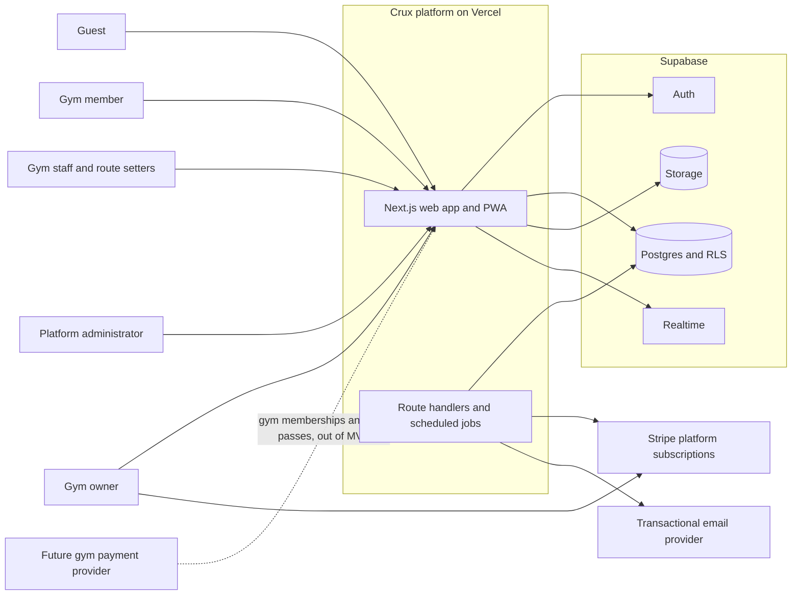
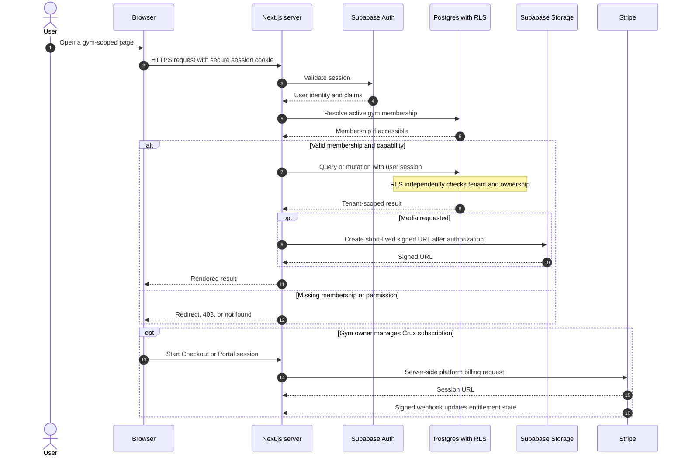

# Architecture decisions

These records define the initial architecture for Crux, a shared multi-tenant climbing-gym platform. Accepted ADRs are not edited to hide a change in direction; a later ADR supersedes them and explains the migration.

## Decision index

| ADR | Decision | Status |
| --- | --- | --- |
| [001](./001-nextjs-app-router.md) | Next.js App Router application boundary | Accepted |
| [002](./002-supabase-services.md) | Supabase as the managed backend | Accepted |
| [003](./003-multi-tenant-data-model.md) | Shared-schema multi-tenancy | Accepted |
| [004](./004-row-level-security.md) | Database-enforced tenant isolation | Accepted |
| [005](./005-roles-and-permissions.md) | Membership-scoped roles and capabilities | Accepted |
| [006](./006-b2b-stripe-billing.md) | Stripe for gym-to-platform billing only | Accepted |
| [007](./007-image-route-mapping.md) | Image-based route maps before 3D | Accepted |
| [008](./008-realtime.md) | Bounded Supabase Realtime use | Accepted |
| [009](./009-file-storage.md) | Supabase Storage with private-by-default media | Accepted |
| [010](./010-audit-logging.md) | Append-only audit trail | Accepted |
| [011](./011-testing-strategy.md) | Layered automated testing | Accepted |
| [012](./012-vercel-deployment.md) | Vercel deployments with isolated environments | Accepted |

## System context

The Stripe connection above is exclusively for a gym buying the Crux software subscription. Money collected by a gym from its members or guests is outside that billing account, data flow, and MVP integration.

## Authenticated request and data flow

Client-provided `gym_id`, role names, prices, and ownership fields are untrusted. The server resolves membership and billing configuration, while Postgres RLS remains the final data-access boundary.

## Cross-cutting non-goals and deferred work

- Native iOS and Android applications; the initial client is a responsive web app/PWA.
- Full 3D wall scanning and computer-vision route recognition; these remain isolated discovery work under the [phase-two 3D/AI plan](../discovery/phase-two-3d-ai.md), not production architecture. AI route grading is not proposed.
- Processing gym membership, class, retail, or day-pass payments through the platform Stripe account.
- Mature direct messaging before reporting, blocking, safeguarding, and moderation controls exist.
- Enterprise identity federation, offline-first mutation queues, custom domains, and multi-region active-active operation.
- Formal UK legal or compliance certification. The design supports privacy, consent, retention, accessibility, and auditability, but requires specialist review.

Deferred items require a new ADR when they alter a trust boundary, data owner, payment flow, or deployment model.
