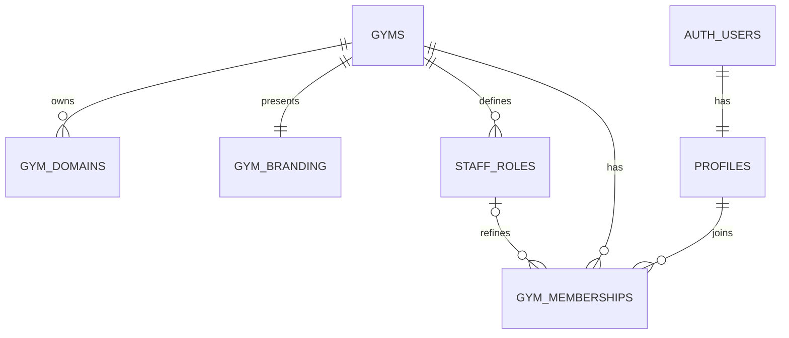
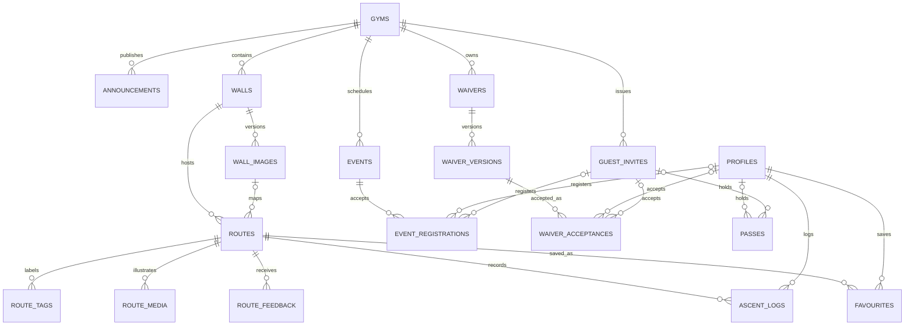
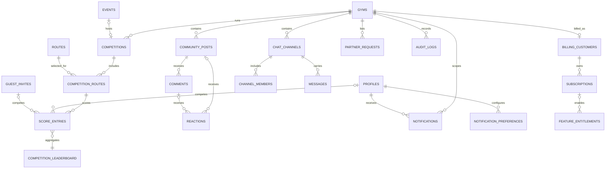

# Data model

The schema is a shared-database, shared-schema multi-tenant model. `profiles` represents a global Supabase Auth identity; `gym_memberships` grants that identity a role and lifecycle state within one gym. Every gym-owned row carries `gym_id`, including nested records. Composite foreign keys pair child identifiers with `gym_id`, preventing a child from referring to a parent in another tenant.

All primary keys are UUIDs. Mutable entities have `created_at` and `updated_at`; auditable or user-generated records use archive, retirement, revocation, void, or soft-delete timestamps rather than destructive deletion. Prompt 4 adds RLS to every exposed table—schema tenant keys are necessary but are not authorization on their own.

## Core tenancy ER diagram

## Gym operations ER diagram

## Engagement and commercial ER diagram

`competition_leaderboard` is derived from non-voided score entries. On Supabase's PostgreSQL 15+ runtime it is configured as `security_invoker`, so access follows underlying RLS. The PostgreSQL 14 smoke-test fallback must remain revoked when Prompt 4 introduces policies.

## Table catalogue

### Identity and tenancy

| Table | Purpose and retention |
| --- | --- |
| `profiles` | Global user-facing identity tied to `auth.users`; account deletion is recorded before Auth cleanup. |
| `gyms` | Tenant root, lifecycle, locale, and safe JSON settings; closed gyms are archived. |
| `gym_domains` | Reserved custom-domain mappings and verification state. |
| `gym_branding` | One accessible palette and private logo-path record per gym. |
| `gym_slug_history` | Append-only record of controlled tenant slug changes. |
| `staff_roles` | Gym-specific named capability bundles; archived rather than reused. |
| `gym_memberships` | User-to-gym role and invited/active/suspended/left lifecycle. |
| `gym_join_credentials` | Current QR identifier and unambiguous short code for authenticated, member-only gym joining. |
| `invitations` | Inaccessible historical member/staff invitation records retained pending a separately reviewed retention migration. No current application flow reads or writes this table. |

### Content, routes, and operations

| Table | Purpose and retention |
| --- | --- |
| `announcements` | Audience-scoped gym notices with publication/archive state. |
| `walls` | Stable physical wall/area records. |
| `wall_images` | Versioned wall photographs with dimensions and private storage paths. |
| `routes` | Gym climbs, grades, lifecycle, setter, wall, and normalized image overlay JSON. |
| `route_tags` | Normalized labels attached to a route. |
| `route_media` | Route image/video metadata and processing status. |
| `route_feedback` | One climber's grade/quality/comment feedback per route. |
| `ascent_logs` | Personal climbing history; soft-deleted to preserve statistics/auditability. |
| `favourites` | A user's saved routes. |
| `events` | Scheduled gym activities and registration windows. |
| `event_registrations` | Exactly one member or invited guest registered for an event. |
| `waivers` | Stable gym waiver identity. |
| `waiver_versions` | Immutable-content versions identified by version and content hash. |
| `waiver_acceptances` | Acceptance snapshot for exactly one profile or guest; never overwritten. |
| `guest_invites` | Hashed, expiring preregistration/check-in flow for a named guest. |
| `passes` | Access rights for exactly one profile or guest. Payment references are reserved for a future gym-controlled integration, not platform Stripe. |

### Engagement, competitions, and communication

| Table/view | Purpose and retention |
| --- | --- |
| `competitions` | Gym competition configuration and lifecycle. |
| `competition_routes` | Tenant-safe competition-to-route selection and scoring values. |
| `score_entries` | One active score per participant and competition route; corrections are voided. |
| `competition_leaderboard` | Derived ranking over active score entries. |
| `community_posts` | Gym-scoped discussions with moderation and soft deletion. |
| `comments` | Threaded post comments with same-post parent constraints. |
| `reactions` | A profile reaction to exactly one post or comment. |
| `chat_channels` | Gym/community/staff/event chat boundaries. |
| `channel_members` | Explicit channel membership, moderation role, mute, and read state. |
| `messages` | Durable channel messages with same-channel replies and soft deletion. |
| `partner_requests` | Expiring gym-scoped climbing-partner posts. |
| `notifications` | Tenant-scoped in-app notification inbox. |
| `notification_preferences` | Per-profile, per-gym delivery preferences. |

### Governance and billing

| Table | Purpose and retention |
| --- | --- |
| `audit_logs` | Append-only actor/action/target events with redacted metadata. |
| `billing_customers` | Stripe customer belonging to a gym buying Crux. |
| `subscriptions` | Stripe B2B SaaS subscription projection and webhook cursor. |
| `feature_entitlements` | Current plan/override/trial feature decisions for a gym. |

The three billing tables represent **gym-to-platform software billing only**. Gym membership fees, classes, retail, and day-pass payments do not use these Stripe customer or subscription records.

## Integrity conventions

- Tenant parents expose a unique `(id, gym_id)` key; nested foreign keys include both values.
- Subject tables use `num_nonnulls(...) = 1` when a record may belong to either a profile or a guest, never both.
- Partial unique indexes enforce one current wall image, one active subject registration/acceptance/score, and one current gym subscription.
- Tokens and access references are stored only as hashes.
- Flexible configuration is `jsonb` constrained to an object; core relationships and authorization fields remain typed columns.
- Foreign-key delete behavior preserves waivers, scores, billing, and audit history while allowing disposable community children to cascade.

## Migration and seed order

1. `20260717160000_foundation.sql` creates identity, tenant, membership, and the now-deprecated historical invitation table.
2. `20260717161000_gym_operations.sql` creates gym content, routes, events, waivers, guests, and passes.
3. `20260717162000_engagement_and_commercial.sql` creates engagement, competitions, notifications, audit, and B2B billing.
4. `supabase/seed.sql` inserts one fictional gym; platform-admin, owner, staff, route-setter, and member profiles; and a guest invitation with deterministic UUIDs.

The seed uses reserved `example.invalid` email addresses and `ON CONFLICT` upserts, making repeated local resets safe. It must not be enabled in production.
